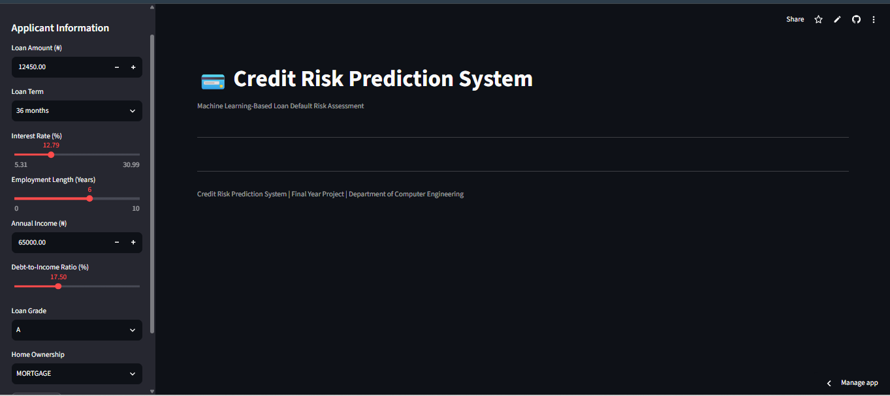
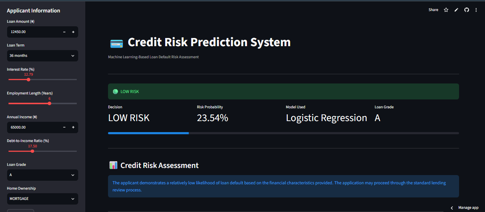
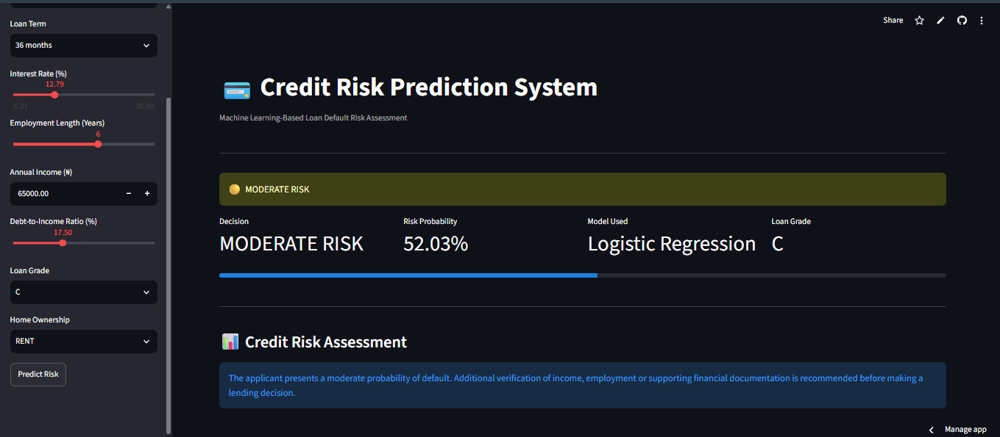
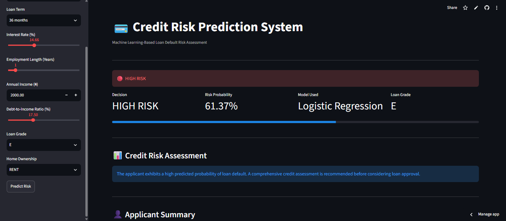

# 💳 Credit Risk Prediction System

A Machine Learning-based web application that predicts the likelihood of loan default using **Logistic Regression** and presents the results through an interactive **Streamlit** interface.


## Live Demo

https://credit-risk-prediction-system-maa9hgs46md5dfdoprwulu.streamlit.app


## Application Preview

### Home Page




### Low Risk Prediction




### Moderate Risk Prediction




### High Risk Prediction




## Project Overview

The objective of this project is to predict whether a loan applicant is likely to repay a loan successfully or default based on selected financial characteristics.

The application estimates the probability of default and classifies applicants into:

- 🟢 Low Risk
- 🟡 Moderate Risk
- 🔴 High Risk

using probability thresholds generated from a trained Logistic Regression model.


## Features

- Interactive Streamlit web application
- Credit risk prediction
- Probability of default estimation
- Dynamic risk classification
- Applicant summary
- Lending recommendation
- Professional user interface


## Machine Learning Model

**Selected Model**

- Logistic Regression

Models evaluated:

- Logistic Regression
- Decision Tree
- Random Forest
- K-Nearest Neighbors (KNN)
- XGBoost

The final model was selected based on its performance on an imbalanced dataset using the F1-score for the High Risk class.


## Dataset

Approximate dataset size:

- **981,951 loan records**

Features used include:

- Loan Amount
- Loan Term
- Interest Rate
- Employment Length
- Annual Income
- Debt-to-Income Ratio
- Loan Grade
- Home Ownership


## Technologies Used

- Python
- Streamlit
- Pandas
- NumPy
- Scikit-learn
- Joblib
- XGBoost


## Installation

Clone the repository:

```bash
git clone https://github.com/TjAnalyze/credit-risk-prediction-system.git
```

Install dependencies:

```bash
pip install -r requirements.txt
```

Run the application:

```bash
streamlit run creditriskapp.py
```


## Future Improvements

- Additional machine learning algorithms
- Explainable AI (SHAP/LIME)
- Database integration
- User authentication
- Loan approval history
- REST API deployment


## Academic Information

This application was developed as a **Final Year Computer Engineering Project** demonstrating the application of Machine Learning techniques to credit risk assessment.
